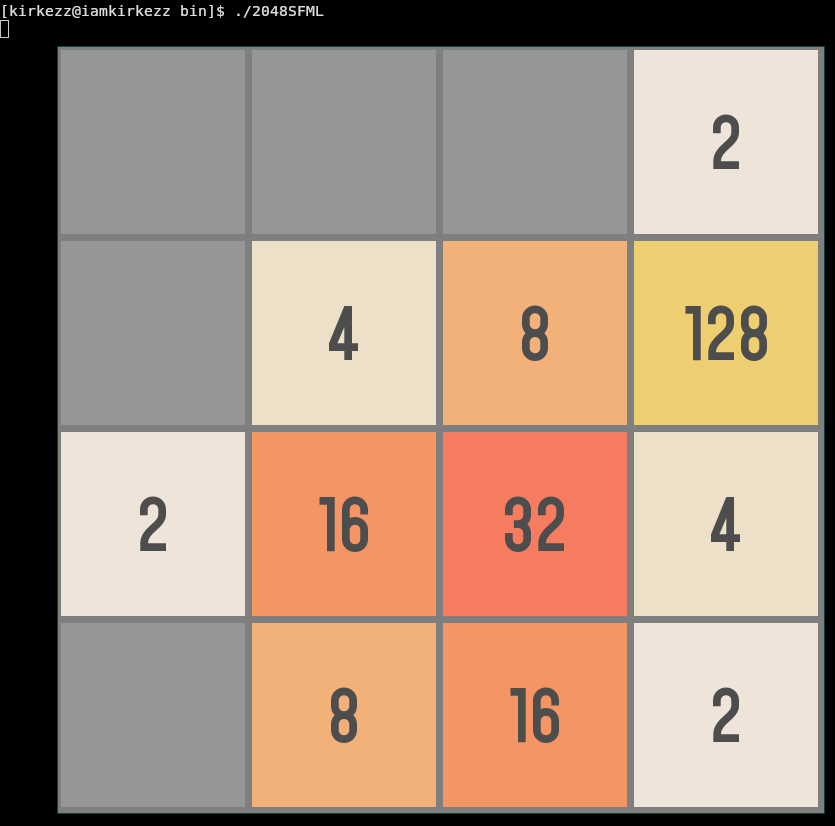

# 2048

A simple implementation of the [2048](https://github.com/gabrielecirulli/2048) game I wrote one day. Seems to contain a few bugs.



## build

The following should work:

```
cmake -S . -B build
cmake --build build --config Release
cd build/bin/
```

## usage

